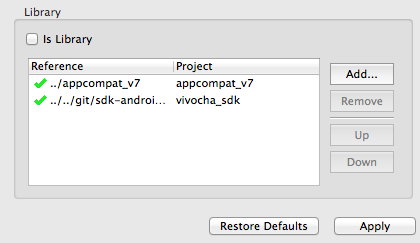
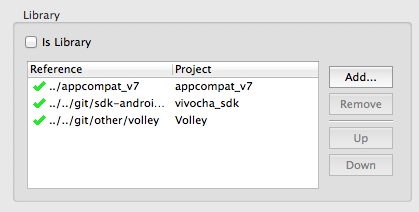
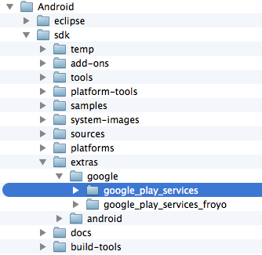

# Android SDK Step-by-step Integration

# Introduction

The Vivocha Android SDK gives you a simple and fast way to integrate the
most common Vivocha features inside your native Android application.

The SDK automatically handles the communication with the Vivocha REST
APIs  and using the Foundry you will have the opportunity to customize
the widgets' look and feel.

With a few lines of code you can give direct support to your customers. 

If there are available agents logged in to your account the SDK
automatically presents a side button inside your application that allows
your customers to ask for help.

When the button is tapped the SDK automatically requests a contact to
your agents then composes and presents a chat view that is very similar
to the most common messaging apps (who said WhatsApp?) that your
customers are used to using.

In order to graphically integrate the chat inside your app you can use
many API hooks to customize the elements' colors and shapes inside the
chat view and the side button.

If you don't want to use the default chat view just turn off the
automatic behaviour, create your view and use the methods to send the
messages and the callbacks the SDK provides to you.

# **Getting started**

## **Vivocha Console**

#### In order to use the Vivocha SDK, you need to configure a Campaign with a Smartphone Channel enabled. You can use the following guide to create it: https://docs.vivocha.com/docs/vcb-smartphone

## **Android SDK**

### **Requirements**

-   The Vivocha Android SDK requires API level 17 (Android 4.2) or
    higher.
-   In order to enable Push Notification, your app needs to be
    registered with Google.

<!-- -->

-   If you want to enable the push notifications, you should add right
    after the Vivocha.start() this method call

        VivochaNotificationManager.manager().register("YOUR_GOOGLE_PROJECT_NUMBER", new VivochaNotificationManagerCallbacks() {

        @Override

        public void onSuccess(String arg0) {

             Log.d("The registration ID is: " + arg0);

             //This is the right place to notify your server for the registration ID, if you need to.

        }

        @Override

        public void onFailure() {

            Log.d("Something went wrong");

        }

        }, showMissingGooglePlayServicesPopup); //if this parameter is true, when a user runs your app from an Android device without the Google Play Services he/she will be asked to install them.

      

-   If you already have a mechanism to fetch the registration ID for the
    push notifications, just notify Vivocha using 

        Vivocha.manager().setPushRegistrationID(regID);

  

Important notice about the video feature

If you wish to use the video feature you'll need to do add a 0px x 0px
SurfaceView inside your main activity layout. This is needed to avoid a
graphic glitch (the screen blinks black) when adding an OpenGL view on
the activity window.  
  
The tag you need to add in your MainActivity layout is  
  

    <SurfaceView android:id="@+id/vivocha_floating_video_fake_surfaceview"

                 android:layout_width="0px" 

                 android:layout_height="0px" 

                 android:background="@android:color/transparent"/>

    It's safe and it shows/changes nothing on your activity appearance.

<table>
<colgroup>
<col style="width: 100%" />
</colgroup>
<tbody>
<tr class="odd">
<td>
If you add 

<pre><code>Vivocha.setDeveloperMode(true); </code></pre>

before the Vivocha.start() call the SDK will fetch the Development configuration you can setup in the Android foundry then you will be able to test a new configuration before release it in the Production environment.
</td>
</tr>
</tbody>
</table>

**  
**

### Eclipse IDE

-   Open the workspace where you have your app's project.
-   In the Package Explorer right click on an empty space and in the
    contextual menu choose Import.  

-   Select ***Android \> Existing Android Code Into Workspace*** and
    press **Next**  
    {width="500"}

-   Browse your file system and select the VivochaSDK library folder  
    {width="500"}
-   Eclipse should find a project to import inside that folder; make
    sure you've selected it and press **Finish**.
-   Now we need to "link" the Vivocha SDK with the Android app.
-   Right-click on your app project and select **Properties**
-   Go to the Android section and in the bottom you should see the
    Library zone
-   Press Add...
-   In the Project Selection popup you should see the VivochaSDK library
    project you added before, select it and press OK  
    {width="500"}
-   The library should now be listed in the Library section with a green
    checkmark on its left.  
    
-   Press OK to close the window.
-   You should now have tons of errors in your console - that's ok! Now
    we have to import the required libraries.
-   The libraries required for Vivocha to work properly are:
    -   Volley - an HTTP connection library made by Google
    -   Google Play Services - needed for the Push Notifications and the
        Location Services.
    -   Smack - This is the XMPP library used for the communication
        stream. (The jar is already built-in the VivochaSDK library
        project)
    -   Google Support Library v4  
        You will find the required libraries inside the Third-Party
        folder inside the VivochaSDK zip.  
          
-   We will now integrate Volley and we'll link it to the Vivocha SDK. 
-   In the Package Explorer right click again in an empty space and
    choose Import
-   Browse your file system inside the Third-Party folder and select the
    volley folder
-   Select only the Volley Project and press Finish  
    {width="500"}
-   Now you have to repeat the steps to link Volley to your app
    project  
    
-   Repeat the steps for the Google Play Services project. You will find
    it under
    YOUR\_ANDROID\_SDK\_FOLDER/sdk/extras/google/google\_play\_services
-   Import only the **google-play-services\_lib **- the other projects
    are just demos and we don't need them.  
      
      

<!-- -->

-   After your complete all the steps above you are ready to write some
    code! Yay!!
-   Open your app manifest. You need to add some lines:

    -   **Android Permissions - Inside the \<manifest\> tag: **

        Needed by Vivocha to work properly  
        \<uses-permission android:name="android.permission.INTERNET"
        /\>  
        \<uses-permission
        android:name="android.permission.SYSTEM\_ALERT\_WINDOW" /\>  
        \<uses-permission android:name="android.permission.GET\_TASKS"
        /\>  
        \<uses-permission
        android:name="android.permission.ACCESS\_FINE\_LOCATION" /\>  
          
        Needed for the Audio/Video feature  
        \<uses-feature android:glEsVersion="0x00020000"
        android:required="true" /\>  
        \<uses-permission android:name="android.permission.CAMERA" /\>  
        \<uses-permission
        android:name="android.permission.MODIFY\_AUDIO\_SETTINGS" /\>  
        \<uses-permission
        android:name="android.permission.RECORD\_AUDIO" /\>

        \<uses-permission
        android:name="android.permission.ACCESS\_NETWORK\_STATE" /\>

        \<uses-permission
        android:name="android.permission.WRITE\_EXTERNAL\_STORAGE"/\>

        Needed for the Push Notifications  
        \<uses-permission
        android:name="com.google.android.c2dm.permission.RECEIVE" /\>  
        \<uses-permission
        android:name="com.google.android.c2dm.intent.RECEIVE"/\>

        **  
        **

    -   **Inside the \<application\> tag: **

        Needed by Vivocha to work properly  
        \<activity
        android:name="com.vivocha.sdk.internal.VivochaChatActivity"
        android:theme="@style/VivochaChatTheme" /\>

         \<activity android:name="com.vivocha.sdk.internal.permissions.VivochaPermissionActivity"
         android:theme="@style/VivochaTransparentActivityTheme" /\> 

        Needed for the Push Notifications and Vivocha  
        \<receiver
        android:name="com.vivocha.sdk.push.VivochaNotificationBroadcastReceiver"
        android:permission="com.google.android.c2dm.permission.SEND" \>  
          
            \<intent-filter\>  
                \<action
        android:name="com.google.android.c2dm.intent.RECEIVE" /\>  
                \<category android:name="com.vivocha.sdk.push" /\>  
            \</intent-filter\>  
        \</receiver\>  
          
        \<service android:name="com.vivocha.sdk.push.VivochaPushService"
        /\>

        Needed for the Google Play Services  
        \<meta-data android:name="com.google.android.gms.version"
        android:value="@integer/google\_play\_services\_version" /\>

        **  
        **

<!-- -->

-   Ok, we are done with the manifest file. Now go to the main Activity
    class of your application.
-   Import **com.vivocha.sdk.Vivocha**
-   In the ***onStart()*** method, after the *super.onStart()* call 

        Vivocha.start(this, "YOUR_ACCOUNT_ID", "YOUR_ANDROID_SERVICE_ID");

      

-   Build and Run your app and it should work fine.   
    If there is an agent logged in to your account, the Live Help label
    will appear on the left side of your device.

Android Studio IDE

-   Open your app's project.
-   Choose **Import Module** from the **File--\>New** menu  
      
    {height="250"}  
      
-   Browse your file system and select the Vivocha SDK library
    folder{width="800"}

<!-- -->

-   If any dependencies are required, they will also be downloaded and
    installed  
    {width="800"}
-   Finally the Vivocha SDK module will be available inside your
    project  
    {width="780"}  
      
-   Now we need to "link" the Vivocha SDK with the Android app.
-   Right-click on your app project and select **Open Module Settings  
    **{width="800"}**  
    **
-   Go to tab **Dependencies** and click on the **+** button**  
    **{width="780"}  
      
-   And select the **vivocha\_sdk** module  
    {width="600"}  
      
-   Once the module was successfully add to your app, open your app
    manifest and add the following lines:  
    -   **Android Permissions - Inside the \<manifest\> tag: **

        Needed by Vivocha to work properly  
        \<uses-permission android:name="android.permission.INTERNET"
        /\>  
        \<uses-permission
        android:name="android.permission.SYSTEM\_ALERT\_WINDOW" /\>  
        \<uses-permission android:name="android.permission.GET\_TASKS"
        /\>  
        \<uses-permission
        android:name="android.permission.ACCESS\_FINE\_LOCATION" /\>  
          
        Needed for the Audio/Video feature  
        \<uses-feature android:glEsVersion="0x00020000"
        android:required="true" /\>  
        \<uses-permission android:name="android.permission.CAMERA" /\>  
        \<uses-permission
        android:name="android.permission.MODIFY\_AUDIO\_SETTINGS" /\>  
        \<uses-permission
        android:name="android.permission.RECORD\_AUDIO" /\>  
        \<uses-permission
        android:name="android.permission.WRITE\_EXTERNAL\_STORAGE"/\>

        Needed for the Push Notifications  
        \<uses-permission
        android:name="com.google.android.c2dm.permission.RECEIVE" /\>  
        \<uses-permission
        android:name="com.google.android.c2dm.intent.RECEIVE"/\>

        **  
        **

    -   **Inside the \<application\> tag: **

        Needed by Vivocha to work properly  
        \<activity
        android:name="com.vivocha.sdk.internal.VivochaChatActivity"
        android:theme="@style/VivochaChatTheme" /\>

         \<activity android:name="com.vivocha.sdk.internal.permissions.VivochaPermissionActivity"
         android:theme="@style/VivochaTransparentActivityTheme" /\> 

        Needed for the Push Notifications and Vivocha  
        \<receiver
        android:name="com.vivocha.sdk.push.VivochaNotificationBroadcastReceiver"
        android:permission="com.google.android.c2dm.permission.SEND" \>  
          
            \<intent-filter\>  
                \<action
        android:name="com.google.android.c2dm.intent.RECEIVE" /\>  
                \<category android:name="com.vivocha.sdk.push" /\>  
            \</intent-filter\>  
        \</receiver\>  
          
        \<service android:name="com.vivocha.sdk.push.VivochaPushService"
        /\>

-   Now go to the main Activity class of your application, import
    **com.vivocha.sdk.Vivocha** and add the call to
    the **Vivocha.start** function by specifying your account id and
    your service id  
      
    {width="800"}  
      
-   Build and Run your app and it should work fine.   
    If there is an agent logged in to your account, the Live Help label
    will appear on the left side of your device.

## Attachments:

{width="8" height="8"} [Screen Shot
2014-07-09 at 16.32.16.png](attachments/1048603/1343764.png)
(image/png)  
{width="8" height="8"}
[android\_btn.png](attachments/1048603/1343765.png) (image/png)  
{width="8" height="8"}
[android\_foundry.png](attachments/1048603/1343767.png) (image/png)  
{width="8" height="8"}
[android\_activation\_code.png](attachments/1048603/1343766.png)
(image/png)  
{width="8" height="8"} [Screen Shot
2014-07-11 at 16.50.03.png](attachments/1048603/1343810.png)
(image/png)  
{width="8" height="8"} [Screen Shot
2014-07-11 at 16.50.58.png](attachments/1048603/1343690.png)
(image/png)  
{width="8" height="8"} [Screen Shot
2014-07-11 at 16.52.54.png](attachments/1048603/1343691.png)
(image/png)  
{width="8" height="8"} [Screen Shot
2014-07-14 at 16.40.09.png](attachments/1048603/1343692.png)
(image/png)  
{width="8" height="8"} [Screen Shot
2014-07-14 at 16.40.31.png](attachments/1048603/1343693.png)
(image/png)  
{width="8" height="8"} [Screen Shot
2014-07-14 at 16.43.55.png](attachments/1048603/1343686.png)
(image/png)  
{width="8" height="8"} [Screen Shot
2014-07-14 at 17.04.10.png](attachments/1048603/1343687.png)
(image/png)  
{width="8" height="8"} [Screen Shot
2014-07-14 at 17.07.20.png](attachments/1048603/1343688.png)
(image/png)  
{width="8" height="8"} [Screen Shot
2014-07-14 at 17.41.41.png](attachments/1048603/1343689.png)
(image/png)  
{width="8" height="8"}
[settings.png](attachments/1048603/9273444.png) (image/png)  
{width="8" height="8"}
[service\_tab.png](attachments/1048603/9273445.png) (image/png)  
{width="8" height="8"}
[new\_service\_button.png](attachments/1048603/9273446.png)
(image/png)  
{width="8" height="8"}
[android\_studio\_01.png](attachments/1048603/17006597.png)
(image/png)  
{width="8" height="8"}
[android\_studio\_01.png](attachments/1048603/17006596.png)
(image/png)  
{width="8" height="8"}
[android\_studio\_02.png](attachments/1048603/17006598.png)
(image/png)  
{width="8" height="8"}
[android\_studio\_03.png](attachments/1048603/17006599.png)
(image/png)  
{width="8" height="8"}
[android\_studio\_04.png](attachments/1048603/17006600.png)
(image/png)  
{width="8" height="8"}
[android\_studio\_05.png](attachments/1048603/17006601.png)
(image/png)  
{width="8" height="8"}
[android\_studio\_06.png](attachments/1048603/17006602.png)
(image/png)  
{width="8" height="8"}
[android\_studio\_07.png](attachments/1048603/17006603.png)
(image/png)  
{width="8" height="8"}
[android\_studio\_08.png](attachments/1048603/17006604.png)
(image/png)  
